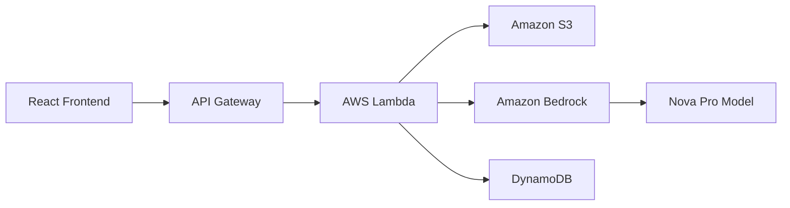

# 🏛️ Praetor - Legal Assistant for Students

[](https://reactjs.org/)
[](https://python.org/)
[](https://aws.amazon.com/)
[](LICENSE)

> **AI-powered legal document analysis specifically designed for university students dealing with rental agreements.**

## 🎯 Problem Statement

University students often face confusion and potential scams when dealing with rental agreements. Complex legal jargon and lengthy clauses make it difficult for students to understand their rights and obligations, leading to:

- ❌ Signing unfavorable lease terms
- ❌ Missing important clauses about deposits, repairs, or termination
- ❌ Being vulnerable to predatory landlords
- ❌ Lack of legal knowledge to negotiate better terms

## 💡 Solution

**Praetor** is an intelligent legal assistant that analyzes rental contracts and provides clear, student-friendly explanations. It categorizes clauses by risk level and highlights potential issues before you sign.

### ✨ Key Features

- 📄 **PDF Contract Upload** - Drag and drop rental agreements for instant analysis
- 🔍 **AI-Powered Analysis** - Uses Amazon Bedrock Nova Pro for intelligent contract review
- 🚦 **Risk Classification** - Color-coded system (🔴 High Risk, 🟡 Caution, 🟢 Normal)
- 💬 **Interactive Chat** - Ask questions about specific clauses or terms
- ⚡ **Real-time Processing** - Live status updates during analysis
- 🎨 **Modern UI** - Clean, intuitive interface designed for students

## 🏗️ Architecture



### Tech Stack

**Frontend:**
- React 19.1.1 with modern hooks
- Lucide React for icons
- Axios for API communication
- CSS3 with responsive design

**Backend:**
- AWS Lambda (Python 3.9+)
- Amazon Bedrock (Nova Pro v1:0)
- Amazon S3 for document storage
- DynamoDB for results caching

**Infrastructure:**
- AWS API Gateway for REST endpoints
- AWS Amplify for frontend hosting
- Serverless architecture for scalability

## 🚀 Quick Start

### Prerequisites

- Node.js 16+ and npm
- AWS Account with appropriate permissions
- AWS CLI configured

### Local Development

1. **Clone the repository**
   ```bash
   git clone https://github.com/yourusername/praetor-legal-assistant.git
   cd praetor-legal-assistant
   ```

2. **Install dependencies**
   ```bash
   npm install
   ```

3. **Set up environment variables**
   ```bash
   cp .env.example .env
   # Edit .env with your configuration
   ```

4. **Start development server**
   ```bash
   npm start
   ```

### AWS Deployment

#### 1. Deploy Lambda Function
```bash
cd lambda/api-handler
zip -r deployment.zip .
# Upload to AWS Lambda via console or CLI
```

#### 2. Configure Environment Variables
Set these in your Lambda function:
- `S3_BUCKET_NAME`: Your S3 bucket for document storage
- `DYNAMODB_TABLE_NAME`: `legal-assistant-results`
- `BEDROCK_MODEL_ID`: `amazon.nova-pro-v1:0`

#### 3. Deploy Frontend to Amplify
```bash
npm run build
# Connect your GitHub repo to AWS Amplify
# Set REACT_APP_BACKEND_URL to your API Gateway URL
```

## 📁 Project Structure

```
praetor/
├── 📁 src/                    # React Frontend
│   ├── App.js                 # Main application component
│   ├── App.css                # Application styling
│   ├── index.js               # React entry point
│   └── index.css              # Global styles
├── 📁 public/                 # Static assets
│   ├── index.html             # HTML template
│   ├── favicon.ico            # Application icon
│   └── manifest.json          # PWA configuration
├── 📁 lambda/                 # AWS Lambda Functions
│   └── 📁 api-handler/        # Main API handler
│       ├── lambda_function.py # Backend logic + Bedrock integration
│       └── requirements.txt   # Python dependencies
├── 📄 package.json            # Node.js dependencies
├── 📄 .env.example            # Environment template
└── 📄 README.md               # This file
```

## 🔧 Configuration

### Environment Variables

**Frontend (.env)**
```env
REACT_APP_BACKEND_URL=https://your-api-gateway-url.amazonaws.com/prod
```

**Lambda Function**
```env
S3_BUCKET_NAME=your-document-bucket
DYNAMODB_TABLE_NAME=legal-assistant-results
BEDROCK_MODEL_ID=amazon.nova-pro-v1:0
AWS_REGION=us-east-1
```

## 🎮 Usage

1. **Upload Document**: Drag and drop a PDF rental contract (max 10MB)
2. **Wait for Analysis**: Real-time progress updates show processing status
3. **Review Results**: Clauses are highlighted and categorized by risk level:
   - 🔴 **High Risk**: Potentially unfavorable or dangerous terms
   - 🟡 **Caution**: Terms that need careful consideration
   - 🟢 **Normal**: Standard, acceptable clauses
4. **Ask Questions**: Use the chat feature to get clarification on specific terms